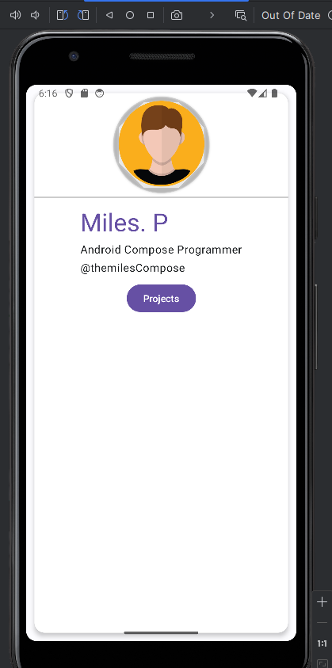
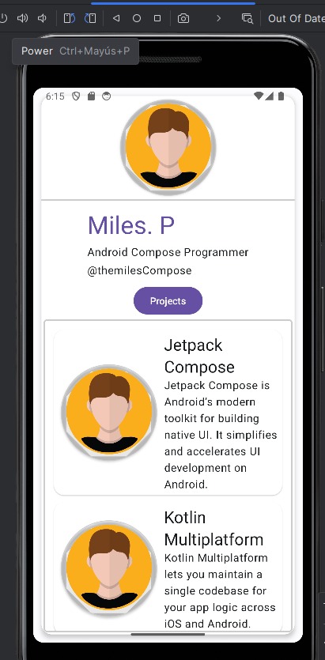

JetBizCard is a Basic business card application built with Jetpack Compose, the modern toolkit for building native Android UI.

## Features

- Displays a business card with a person's name.
- Lists the projects associated with the person.
- Uses Jetpack Compose for the UI.
- Data for the projects is fetched from a local data source (Singleton class).

## Jetpack Compose Components

In this project, we extensively use the following Jetpack Compose components:

- `Row`: A composable that places its children in a horizontal sequence.
- `Column`: A composable that places its children in a vertical sequence.
- `LazyColumn`: A composable that efficiently displays large lists. It only composes and lays out the items that are currently visible on the screen.
- `Surface`: A composable that provides a surface with an optional background color and elevation. It's often used to wrap other composables and apply common graphic attributes to them.
- `Card`: A predefined `Surface` that follows Material Design guidelines. It's often used to display information on a separate piece of material in your UI.
- `State`: A composable that holds and manages a value. When the value changes, the composable is recomposed.

## Technologies Used

- Kotlin
- Jetpack Compose

## Getting Started

1. Clone the repository.
2. Open the project in Android Studio Jellyfish | 2023.3.1.
3. Run the application on an emulator or a physical device.

## Screenshots

